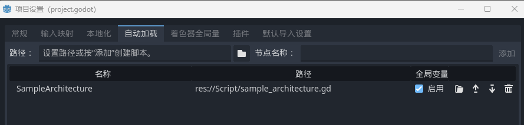

# Architecture
### 示例
```python
extends BaseArchitecture

func _init():
	_register_signal_bus("Main", SampleSignalBus)
	
	register_component("SampleModel", SampleModel.new())
	register_component("SampleSystem", SampleSystem.new())
	register_component("SampleUtility", SampleUtility.new())
```

Architecture 类负责进行模块管理，一般被设置为单例  
建议使用 Godot 的 AutoLoad 功能自动加载单例  

  

可以在 _init() 函数中注册信号总线和组件  
被注册的脚本可以在其他脚本中被获取

#### 注册信号总线 [Signal](Signal.md)
bus_name: 自定义总线名  
bus_class: 总线类名

```python
func _register_signal_bus(bus_name, bus_class)
```

#### 注册组件 [Component](Component.md)
在RF中，model、system、utility被统称为组件component  
实际上任何一个脚本都可以当作组件进行注册

key: 组件标识  
component: 组件实例 

```python
func register_component(key, component)
```

以键值对的方式将组件注册到架构中  