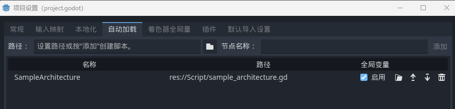

# Controller
操控游戏逻辑  
继承 BaseController 类
#### 初始化
在使用框架功能前需要先执行函数指定 architecture  
architecture 参数传入 BaseArchitecture 子类实例 [Architecture](Docs/Architecture.md)  
```
_set_architecture(architecture)
```
Architecture 一般被设置为单例  
建议使用 Godot 的 AutoLoad 功能自动加载单例  

  

此时指定 architecture  的方法为  
```
_set_architecture(SampleArchitecture)
```
#### 功能
Controller 类中可以连接信号、发送命令、获取组件  
见 [Function](Docs/Function.md)