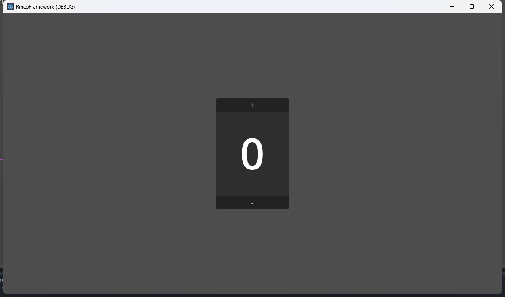

# 示例项目
复刻了凉鞋老师介绍 QFramework 时用到的示例项目  
关于 QFramework 的示例项目，[文档](https://www.gamepixedu.com/goods/show/25?targetId=50&preview=0)中有详细的迭代过程，介绍了各个模块设计的目的  
此处只对整个项目进行逐一解释，可以先阅读 QF 的文档再来对应参考本篇


点击加号数字加一，点击减号数字减一，数字达到某个数值时获得成就

## [Architecture](Architecture.md)
Architecture 架构脚本用于管理模块，继承 BaseArchitecture 类  
在 _init() 方法中注册信号总线(SignalBus)、模型(Model)、系统(System)以及工具(Utility)，后文分别进行介绍
```python
extends BaseArchitecture

func _init():
    	# 信号总线
   	register_signal_bus("Main", MainSignalBus)
	
  	# 工具
	register_utility("Storage", Storage.new())
	
	## 组件
	# 系统
	register_component("AchievementSystem", AchievementSystem.new())
	# 模型
	register_component("CounterAppModel", CounterAppModel.new())
	
```
将该脚本设置为单例。在此使用了Godot提供的 AutoLoad 功能


## [Utility](Utility.md)
任何脚本都可以被视为工具类  
定义存储工具类，用于保存数据  
将工具类注册到 Architecture 中后可以在各处调用
```python
class_name Storage

var config = ConfigFile.new()

func _init():
	var err = config.load("user://storage.cfg")
	if err != OK:
		print("加载失败.")

func save_data(key: String, value):
	config.set_value("Storage", key, value)
	config.save("user://storage.cfg")

func load_data(key: String, default_value=0):
	var value = config.get_value("Storage", key, default_value)
	return value

```

## [SignalBus](Signal.md)
信号总线用于统一管理信号，在各处进行连接的信号都会被挂载在总线节点上  

定义信号类，继承 BaseSignal 类  
当数字发生变化时，发送该信号
```python
extends BaseSignal
class_name CountChangeSignal

# func _init():
# 	must_have_param = []
```
将信号封装为类的目的是为了设置固定参数随信号进行传递  
在 _init() 方法中为 must_have_param 列表赋值，包含信号必须携带的参数  
如:
```python
must_have_param = ["param1","param2"]
```
示例中不需要传递参数  

定义信号总线类，继承 BaseSignalBus 类  
信号总线用来统一挂载信号，可以定义多个总线分组管理信号  
在 _init() 方法中为 signal_classes 列表赋值，包含总线挂载的信号类 
此处挂载了上面定义的 CountChangeSignal 信号类
```python
extends BaseSignalBus
class_name MainSignalBus

func _init():
	signal_classes = [CountChangeSignal]
```
在 Architecture 中对总线进行注册后，可以在其他脚本中对信号进行连接和发送

## [Model](Component.md)
定义模型类，继承 BaseModel 类  
模型类用于保存需要供多个脚本使用的数据，此处定义了示例项目中被按钮操控的数字  
在 _init_component() 方法中对数据进行初始化  
其中调用了注册好的存储工具类，执行加载方法，获取上次记录的数字  
在数字发送变化时执行保存方法，将新数字进行保存，并发送数字改变信号
```python
extends BaseModel
class_name CounterAppModel

var storage

var count = 0:
	get:
		return count
	set(value):
		if count != value:
			count = value
			storage.save_data("count", count)
			emit_signal_handle.execute("Main", CountChangeSignal)

func _init_component():
	storage = get_utility_handle.execute("Storage")
	count = storage.load_data("count", 0)
```


## [System](Component.md)
定义系统类，继承 BaseSystem  
系统类中一般实现一些独立的模块功能  
此处定义了一个成就系统  
在 _init_component() 方法中获取到数字模型、存储工具，并连接到数字变化信号  
当其他脚本发送信号 CountChangeSignal 时，从模型 CounterAppModel 中获取当前数字，如果数字满足一定条件，则触发成就  
随后通过存储工具 Storage 获取玩家当前的成就达成情况，如果当前成就处于未完成状态则解锁成就并保存，否则略过

```python
extends BaseSystem
class_name AchievementSystem

enum Achievement{
	ROOKIE,
	INITIATE,
	EXPERT,
}

var model
var storage

func _init_component():
	model = get_component_handle.execute("CounterAppModel")
	storage = get_utility_handle.execute("Storage")
	
	connect_signal_handle.execute("Main", CountChangeSignal, 
		func(data):
			if model.count == 10:
				achievement_completed(Achievement.INITIATE)
			elif model.count == 20:
				achievement_completed(Achievement.EXPERT)
			elif model.count == -10:
				achievement_completed(Achievement.ROOKIE)
	)

func achievement_completed(achievement_name: Achievement):
	if not save_achievement(achievement_name):
		return
	
	match achievement_name:
		Achievement.ROOKIE:
			print("点击菜鸟")
		Achievement.INITIATE:
			print("点击学徒")
		Achievement.EXPERT:
			print("点击专家")

func save_achievement(achievement) -> bool:
	# 成就未解锁则保存，返回true，已解锁则返回false
	var flag = storage.load_data(str(achievement))
	if flag:
		print("成就已解锁.")
		return false
	storage.save_data(str(achievement), 1)
	return true
```

## [Command](Command.md)
命令类用于封装固定的操作。涉及命令模式  
定义数字增加命令和数字减少命令，继承 BaseCommand 类  
此处介绍数字增加命令  
当命令被调用时会执行 execute() 方法  
获取到模型 CounterAppModel 并将数字加一   
数字减少命令与其类似
```python
extends BaseCommand
class_name IncreaseCountCommand

func execute(data):
    get_component_handle.execute("CounterAppModel").count += 1
```

## [Controller](Controller.md)
控制类处理游戏逻辑  
需要挂载在场景中的节点上  
定义数字控制器，继承 BaseController 类  
该脚本中获取到模型 CountChangeSignal  
定义方法 update_view() 并连接到 CountChangeSignal 信号上，当数字改变时从模型中拿到最新数据来更新画面上的数字  
将数字增减命令绑定到加减两个按钮上，按下按钮时发送对应命令操作数字  

需要重写 _get_architecture() 方法指定 Architecture  
由于 CounterApp 架构类被设置为了 AutoLoad 单例，因此可以直接通过设置的名称拿到
```python
extends BaseController

@export var add_button: Button
@export var sub_button: Button
@export var count_text: Label

var model = get_component_handle.execute("CounterAppModel")

func _ready():

	connect_signal_handle.execute("Main", CountChangeSignal, update_view)
	
	add_button.pressed.connect(
		func(): send_command_handle.execute(IncreaseCountCommand.new())
	)
	sub_button.pressed.connect(
		func(): send_command_handle.execute(DecreaseCountCommand.new())
	)
	
	update_view()

func update_view(data={}):
	count_text.text = str(model.count)

func _get_architecture():
	return CounterApp
```

<br>

至此示例项目预期功能实现
